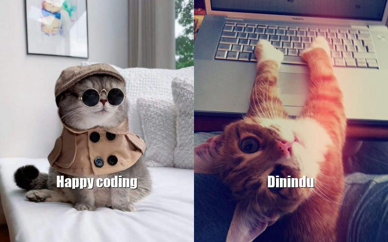

# Cat Card Generator



The Cat Card Generator is a fun application that generates random cat-themed greeting cards. Each card features two cat images and a customizable message.

## Table of Contents

- [Features](#features)
- [Prerequisites](#prerequisites)
- [Installation](#installation)
- [Configuration](#configuration)
- [Usage](#usage)

## Features

- Generates random cat-themed greeting cards.
- Customizable messages for each card.
- High-quality cat images.

### Prerequisites

    node.js = 18.15.0
    npm = 9.5.0

## Installation

- Clone the repository:

  ```bash
  git clone https://github.com/Dinindu-Nissanka/cat-card-generator.git
  ```

- Install dependencies:

  ```bash
  cd cat-card-generator
  npm install
  ```

## Configuration

A sample environment file is provided with a name of `.env.example`. Rename the `.env.example` to `.env` and provide the base url.

    BASE_URL='https://cataas.com/cat/says'

## Usage

The cat card can be easily customized. While executing the command, the user can provide the greeting text along with the recipient's name to whom this card is being sent. The image's width, height, color, and size can be easily configured through arguments. Additionally, the file name and file location where the file will be stored can also be provided as arguments.

```bash
npm run start -- --greeting=<greeting> --who=<who> --width=<width> --height=<height> --color=<color> --size=<size> --fileName=<fileName> --filePath=<filePath>
```

Please note that if the user does not provide above mentioned arguments, the application will use the default values which are

- greeting - `Hello`
- who - `You`
- width - `400`
- height - `500`
- color - `Pink`
- size - `100`
- fileName - `cat-card.jpg`
- filePath - `./`
